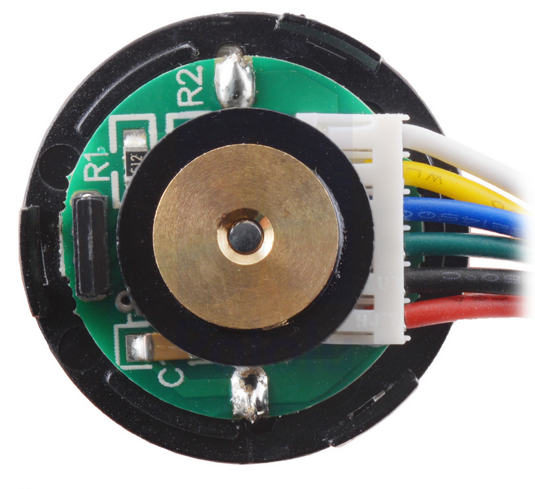
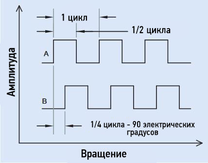
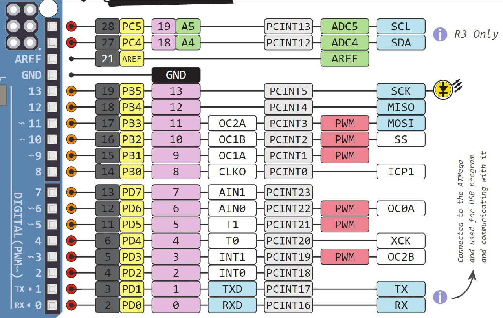
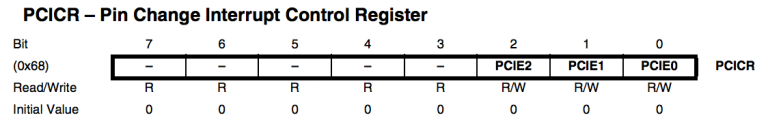
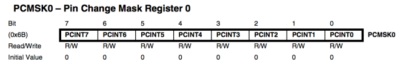
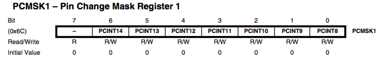
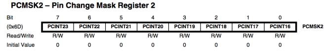

# Управление двигателем постоянного тока на Arduino UNO

Разработку системы управления двигателем можно разбить на несколько модулей:
0. Таймер, регулирующий частоту главного цикла программы
1. Драйвер энкодера (считывание текущего угла)
2. Драйвер двигателя (выдача требуемого напряжения)
3. Вычислитель скорости (определение текущей скорости вала двигателя)
4. ПИ регулятор скорости (управление скоростью)
5. П регулятор положения (управление положением)

## Общая структура программы


```c++
void loop()
{
  ///////// TIMER /////////
  // Задание постоянной частоты главного цикла прогааммы
  static uint32_t timer = micros();
  while(micros() - timer < Ts_us)
    ;
  timer = micros();
  
  ///////// SENSE /////////
  // Считывание датчиков

  ///////// PLAN /////////
  // Расчет управляющих воздействий

  ///////// ACT /////////
  // Приведение управляющих воздействий в действие и логирование данных  
}
```

## Выдержка постоянной частоты

Зададимся требуемым периодом выполнения главного цикла программы:

```c++
#define Ts_us 5000 // Период квантования в [мкс]
#define Ts_s (Ts_us / 1000000.0) // Период квантования в [с]
```

И реализуем адаптивную задержку в начале `void loop()`:

```c++
void loop()
{
    static uint32_t timer = micros();
    while(micros() - timer < Ts_us)
        ;
    timer = micros();
    ///
    ...
}
```

Теперь главный цикл будет выполнятся не чаще чем раз в 5 миллисекунд.

## Драйвер энкодера

Используемые двигатели постоянного тока оборудованы на задней части вала квадратурным инкрементальным энкодером, с помощью которого есть возможность замкнуть обратную связь по скорости и положению мотора.



### Определение положения

#### Параметры энкодера

```c++
#define ENC_PIN_A 2
#define ENC_PIN_B 3

#define ENC_PORT PIND
#define ENC_MASK 0b00001100
#define ENC_SHIFT 2

#define ENC_DIR 1
#define ENC_PPR 48
#define GEAR_RATIO 47
```


#### PIN CHANGE INTERRUPTS

Квадратурный экодер при вращении вала генерирует сигналы A и B следующего вида:



Для использования полной точности энкодера необходимо использование всех 4х фронтов сигналов внутри одного периода, чего можно добится с использованием прерываний по изменению пина (Pin change interrupts). В отличие от обычных внешних прерываний, которые прикрепляются с помощью функции `attachInterrupt()`, которых очень ограниченное количество (всего два пина на Arduino UNO), прерывания PCINT можно активировать для абсолютно любых пинов Ардуино, что позволяет использовать этот метод чтения энкодера с любым количеством подключенных энкодеров не теряя в точности.


Для включения этих прерываний необходимо выполнить три действия:
1) Включить прерывания по изменению пина
2) Выберить, на каких портах и пинах выполнять прерывания
3) Реализовать обработчик ISR для нужных портов

##### 1. Включение прерываний

В нашем случае энкодер подключен на пины 2 и 3, что соответствует пинам PD2 и PD3, которые принадлежат порту D.



Для включения прерываний PCINT на этом порту выставим третий бит в регистре PCICR:
```C++
PCICR |= 0b00000100;    // Включить на порту D
```


##### 2. Выбираем нужные пины

Энкодер подключен на пины PD2 и PD3, что соответствует каналам PCINT18 и PCINT19.





```C++
PCMSK2 |= 0b00001100; // Включить пины PD2 & PD3 (PCINT18 и PCINT19)
```

##### 3. Пишем обработчик прерывания

Внешний вид обработчика выглядит следующим образом. Далее приведен более подробный его разбор.

```c++
ISR(PCINT2_vect) // Port D, PCINT16 - PCINT23
{
    const uint8_t enc = ((*ENC_PORT) & ENC_MASK) >> ENC_SHIFT;
    counter += ett[enc_zn1][enc];
    enc_zn1 = enc;
}
```

<details>
  <summary>Чуть более подробное и общее описание процесса</summary>

> Оригинальный урок: https://thewanderingengineer.com/2014/08/11/arduino-pin-change-interrupts/
>
> Ниже представлен его перевод

##### 1. Включение прерываний

Для включения PCINT необходимо выставить определенные биты в регистре PCICR (Pin Chane Interrupt Control Register). Бит 0 включает PCINT на порту B (PCINT0-PCINT7), бит 1 включает на порту C (PCINT8-PCINT14), и бит 2 включает на порту D (PCINT16-PCINT23). Код ниже показывает как можно включить некоторые комбинации. Обратите внимание, используется не присвоение `'='`, а побитовое ИЛИ: `'|='`, т.к. мы как правило не хотим перезаписывать все биты, однако в нашем случае можно использовать и то и то. Кроме двоичного представления чисел можно также использовать шестнадцатиричное или десятичное. Однако в данном случае двоичное воспринимать проще.

```C++
PCICR |= 0b00000001;    // Включить на порту B
PCICR |= 0b00000010;    // Включить на порту C
PCICR |= 0b00000100;    // Включить на порту D
PCICR |= 0b00000111;    // Включить на всех портах
```


##### 2. Выбираем нужные пины

Помимо включения прерываний для целого порта, необходимо также включить нужные пины внутри этого порта. Для этого используется несколько специальных регистров-масок. Так как на Atmega328 портов всего три, регистров-масок тоже три: PCMSK0, PCMSK1 и PCMSK2. Их можно модифицировать также как мы модифицировали регистр PCICR. Можно использовать и `'='` и `'|='`, однако последний вариант позволяет разделить выставление битов на несколько строчек без перезатирания уже выставленных битов.


```C++
PCMSK0 |= 0b00000001; // Включить пин PB0 (PCINT0), пин 8 на Arduino
PCMSK1 |= 0b00010000; // Включить пин PC4 (PCINT12), пин A4 на Arduino
PCMSK2 |= 0b10000001; // Включить пины PD0 и PD7 (PCINT16 и PCINT23), пины 0 и 7 на Arduino
```

##### 3. Пишем обработчик прерывания ISR

Последним шагом будет написание функции-обработчика, которая будет вызываться при срабатывании прерывания. Для объявления функции их следует объявить так:

```c++
ISR(PCINT0_vect){}    // Port B, PCINT0 - PCINT7
ISR(PCINT1_vect){}    // Port C, PCINT8 - PCINT14
ISR(PCINT2_vect){}    // Port D, PCINT16 - PCINT23
```
  
</details>

#### Обработчик прерывания

Определение направления вращения двигателя можно реализовать следующим образом. Сигналы A и B можно скомбинировать в двухбитное целое число. В зависимости от текущей фазы поворота двигателя - это число может принимать значения 00, 01, 11 и 10. Из предыдущего и текущего значения фазы можно однозначно определить в какую сторону был повернут вал двигателя.

Для решения этой задачи составим таблицу `ett` (`encoder transition table`), в которой для каждой комбинации предыдущего значения и текущего значения фазы энкодера определяется направление инкремента соответствующее данной комбинации:

|    | 00 | 01 | 11 | 10 |
|:--:|:--:|:--:|:--:|:--:|
| 00 |  0 | -1 |  0 |  1 |
| 01 |  1 |  0 | -1 |  0 |
| 11 |  0 |  1 |  0 | -1 |
| 10 | -1 |  0 |  1 |  0 |

Таким образом, в обработчике прерываний для определения направления проворота вала двигателя достаточно обратится в таблицу и прочитать соответствующее значение.

```C++
volatile int counter = 0;
float phi = 0;
float tick_to_rad = 0;
int8_t ett[4][4] = {0};

void encoder_init()
{
    // Инициализация пинов энкодера
    pinMode(ENC_PIN_A, INPUT);
    pinMode(ENC_PIN_B, INPUT);

    // https://thewanderingengineer.com/2014/08/11/arduino-pin-change-interrupts/
    // Настройка прерываний энкодера
    PCICR |= 0b00000100; // turn on port D change interrupts
    PCMSK2 |= 0b00001100; // turn on pins PD2 & PD3 (D2 and D3)

    // Настройка таблицы переходов
    ett[0b00][0b10] = ENC_DIR;
    ett[0b10][0b11] = ENC_DIR;
    ett[0b11][0b01] = ENC_DIR;
    ett[0b01][0b00] = ENC_DIR;

    ett[0b00][0b01] = -ENC_DIR;
    ett[0b01][0b11] = -ENC_DIR;
    ett[0b11][0b10] = -ENC_DIR;
    ett[0b10][0b00] = -ENC_DIR;

    // Расчет коэффициента пересчета
    tick_to_rad = 2.0 * M_PI / (ENC_PPR * i);

}
```

Обработчик прерываний:

```c++
ISR(PCINT2_vect) // Port D, PCINT16 - PCINT23
{
    static uint8_t enc_zn1 = 0;
    const uint8_t enc = (ENC_PORT & ENC_MASK) >> ENC_SHIFT;
    counter += ett[enc_zn1][enc];
    enc_zn1 = enc;
}
```

#### Подсчет реального угла двигателя

Функция считывает накопленное прерываниями количество тиков энкодера и пересчитывает их в угол вала в радианах. `tick_to_rad` - коэффициент пересчета из тиков энкодера в радианы угла поворота двигателя.

```c++
void encoder_tick()
{
    noInterrupts();
    const int16_t counter_inc = counter;
    counter = 0;
    interrupts();

    phi += counter_inc * tick_to_rad;
}
```

В результате в переменную `phi` будет сохранен текущий угол вала двигателя в радианах.

## Драйвер мотора

Параметры мотора:

```C++
#define MOTOR_IN 10
#define MOTOR_PWM 11
#define MOTOR_DIR 1
#define SUPPLY_VOLTAGE 12
```

Инициализация мотора:

```c++
void motor_init()
{
  pinMode(MOTOR_IN, OUTPUT);
  pinMode(MOTOR_PWM, OUTPUT);
}
```

Выдача напряжения:
```c++
void motor_tick(float u)
{
  const int16_t pwm = 255.0 * constrain(u / SUPPLY_VOLTAGE, -1.0, 1.0) * MOTOR_DIR;

  if (pwm >= 0)
  {
    digitalWrite(MOTOR_IN, LOW);
    analogWrite(MOTOR_PWM, pwm);
  }
  else
  {
    digitalWrite(MOTOR_IN, HIGH);
    analogWrite(MOTOR_PWM, 255 + pwm);
  }
}
```

## Вычислитель скорости

Вычисление производной с фильтрацией:

```c++
float velocity_estimator(float pos)
{
    static float pos_old = pos;
    static float vel = 0;

    const float delta_pos = pos - pos_old;
    const float inst_vel = delta_pos / Ts_s;

    const float filtering = 0.1;
    vel = (1.0 - filtering) * inst_vel + filtering * vel;
}
```

## ПИ регулятор скорости с защитой от насыщения

```c++
float vel_pi_reg(float err, float max_output)
{
    const float K = 1;
    const float T = 0.3;
    const float Kp = K_xi;
    const float Ki = K_xi / T_xi;

    const float p = err * Kp;
    static float I = 0;
    const float i = I * Ki;
    const float u = p + i;
    
    if (u == constrain(u, -max_output, max_output) || (err * u) < 0)
        I += err * Ts_s;

    return u;
}
```

Использование ПИ регулятора:

```c++
void loop()
{
  ...
  const float vel0 = (analogRead(A1) - 512) / 50.0;
  ///////// PLAN /////////
  const float vel = velocity_estimator(phi);

  const float err = vel0 - vel;
  const float u = vel_pi_reg(err, SUPPLY_VOLTAGE);
  
  ///////// ACT /////////
  motor_tick(u);
  ...
}
```

## П регулятор положения

```c++
void loop()
{
  ...
  const float pos0 = (analogRead(A1) - 512) / 50.0;
  ///////// PLAN /////////
  const float Kp_phi = 1;
  const float vel0 = (pos0 - phi) * Kp_phi;
  const float vel = velocity_estimator(phi);

  const float err = vel0 - vel;
  const float u = vel_pi_reg(err, SUPPLY_VOLTAGE);
  
  ///////// ACT /////////
  motor_tick(u);
  ...
}
```
